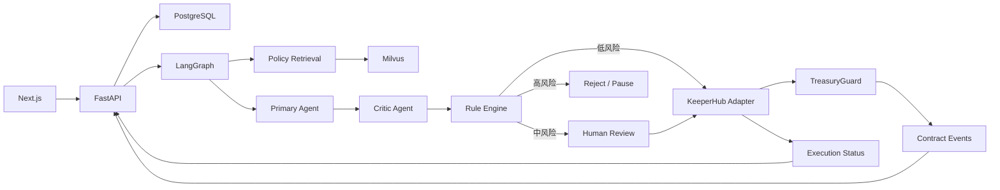

# Treasury Sentinel — Policy-Aware Autonomous Treasury Agent

## 1. 项目摘要

Treasury Sentinel 是面向 DAO 与中小企业的自主财资守卫。系统读取付款申请、供应商资料、链上状态和企业政策，通过 Primary Agent、Critic Agent、确定性规则引擎和智能合约判断付款是否可以自动执行，并使用 KeeperHub 完成模拟、广播、状态追踪和审计。

核心命题不是“AI 可以付款”，而是：

> 系统可以证明 AI 为什么有权付款，并保证 AI 判断错误时也无法越权。

项目按单人、8 天、从零交付设计，同时瞄准 KeeperHub Agents Onchain 主赛前三名与两个 Developer Onboarding 奖。

## 2. 成功标准

1. Base Sepolia 上至少一笔真实测试 USDC 付款可验证。
2. 深度使用 KeeperHub 的预检查、模拟、执行、状态追踪、恢复和审计能力。
3. 展示 Primary 与 Critic 的决策分歧和风险升级。
4. 规则引擎与合约限制金额、地址、额度、重复发票和暂停状态。
5. 决策哈希、政策版本、KeeperHub execution ID、交易哈希和合约事件可关联。
6. 正常付款、重复发票、地址篡改、超额度和紧急暂停五个场景可重复运行。
7. 新开发者能依据双语 Quickstart 在 10–15 分钟内跑通最小示例。

## 3. 奖金覆盖矩阵

| 奖项目标 | 项目证据 |
| --- | --- |
| 主赛前三名 | 真实链上执行、完整 Agent 循环、Critic、三层安全约束、异常恢复、审计控制台 |
| Onboarding 方向一 | 可复用 KeeperHub Adapter、LangGraph 示例、环境检查工具 |
| Onboarding 方向二 | 中英文教程、故障排查、可复现问题报告、文档改进建议 |
| 技术深度 | 合约、PostgreSQL、Milvus、LangGraph、KeeperHub 端到端闭环 |
| 原创性 | 独立质疑、可验证决策证明、Agent 触发财资紧急暂停 |
| 可采用性 | 清晰模块边界、OpenAPI、测试、Starter Kit 和双语文档 |

上一届官方复盘强调真实可运行、深入集成、测试充分和可被采用的成果，而不是浅层 API 包装：[KeeperHub Hackathon Wrap-up](https://keeperhub.com/blog/010-openagents-hackathon-wrap)。

## 4. 范围

### 必须实现

- Next.js 控制台、FastAPI、Python LangGraph。
- Primary Agent、Critic Agent、确定性规则引擎。
- 使用已部署 PostgreSQL 作为业务事实源。
- 使用已部署 Milvus 作为政策语义检索服务。
- 一个 `TreasuryGuard` 合约、Base Sepolia、单一测试 USDC。
- KeeperHub 执行钱包、人工审批降级、五个固定 Demo。
- Starter Kit、中英文文档和反馈报告。

### 明确排除

- 主网资金、多链、跨链和多 Token。
- 完整 ERP、银行接口、PDF OCR 和邮件自动收件。
- 多租户、SSO、复杂 RBAC、自建 Embedding 模型。
- PostgreSQL/Milvus 部署编排、x402 收费、Safe 多签、通用低代码平台。

## 5. 技术栈

| 层 | 技术 |
| --- | --- |
| 前端 | Next.js、TypeScript |
| API | FastAPI、Pydantic、SSE |
| Agent | Python LangGraph |
| LLM | 火山方舟 Doubao Seed 2.0 Mini |
| 结构化数据 | 已部署 PostgreSQL |
| RAG | 已部署 Milvus + 本地 `bge-small-zh-v1.5` |
| 合约 | Solidity、Hardhat、OpenZeppelin |
| 链 | Base Sepolia |
| 执行 | KeeperHub MCP/API Adapter |
| 测试 | Pytest、Hardhat Test、轻量 E2E |

### 5.1 模型部署决策

本项目是黑客松 Demo，最终运行形态采用混合方式：

- Next.js、FastAPI、LangGraph 和 Embedding 推理在开发者 Mac 本地运行。
- PostgreSQL 与 Milvus 使用现有已部署实例。
- LLM 使用火山方舟 Doubao Seed 2.0 Mini API。
- KeeperHub 和 Base Sepolia 使用远程服务。
- 演示网站不要求公网部署，使用本地浏览器录制演示视频即可。

本地演示仍需要真实调用 KeeperHub 并产生测试网交易；“不部署网站”不等于使用 Mock 替代链上执行。提交材料应提供架构、运行说明、测试网合约地址、交易哈希和录制视频。若比赛提交页强制要求在线 Demo URL，再单独部署前端/API，不改变核心架构。

### 5.2 本地嵌入模型评估

已检查 `/Volumes/wd2t/model`，现有候选如下：

| 模型 | 体积 | 向量维度 | 最大位置 | 适合度 | 结论 |
| --- | ---: | ---: | ---: | --- | --- |
| `bge-small-zh-v1.5` | 183 MB（含两份权重格式） | 512 | 512 | 中文政策检索、启动快、资源低 | **采用** |
| `nlp_gte_sentence-embedding_chinese-base` | 391 MB | 768 | 512 | 中文效果可用，但更重 | 备用 |
| `nomic-embed-text-v1.5` | 4.0 GB | 768 | 2,048+ | 更偏英文、需要自定义代码与更高资源 | 不采用 |

选择 `bge-small-zh-v1.5` 的理由：政策和 Demo 查询以中文为主；模型目录完整，包含 tokenizer、Sentence Transformers 配置、512 维 CLS pooling 和归一化模块；183 MB 足以在 24 GB Apple M4 Mac 上本地运行，且不需要下载新模型。

运行约束：

- 本地 Python 环境需安装 `torch`、`sentence-transformers` 和 `pymilvus`；当前系统默认 Python 尚未安装这些依赖，项目应在独立虚拟环境中声明。
- 查询添加 BGE 官方推荐前缀：`为这个句子生成表示以用于检索相关文章：`；政策正文不加前缀。
- 文本按政策章节切分，建议每块 150–350 个中文字符，不依赖 512 token 上限塞入长文档。
- Embedding 做归一化，Milvus 使用 `COSINE`，Collection 维度固定为 `512`。
- 模型路径通过 `EMBEDDING_MODEL_PATH` 配置，默认值为 `/Volumes/wd2t/model/bge-small-zh-v1.5`。
- 切换到 768 维模型时必须新建 Collection 并重新摄取，禁止将不同维度或不同模型的向量混入同一 Collection。

### 5.3 Doubao Seed 2.0 Mini

Primary 与 Critic 共用 Doubao Seed 2.0 Mini，但使用独立 system prompt、独立调用和严格结构化 Schema。默认模型标识配置为 `doubao-seed-2-0-mini-260428`，同时允许使用火山方舟控制台生成的 Endpoint ID 覆盖，避免把账号级 Endpoint 写死在代码中。

环境变量：

```text
ARK_API_KEY=
ARK_BASE_URL=https://ark.cn-beijing.volces.com/api/v3
DOUBAO_MODEL=doubao-seed-2-0-mini-260428
DOUBAO_PRIMARY_TEMPERATURE=0.1
DOUBAO_CRITIC_TEMPERATURE=0.1
```

模型只提出建议和风险解释，最终交易参数必须来自已验证的数据库快照与规则引擎。输出先经 JSON/工具调用约束，再经 Pydantic 校验；失败时有限重试，随后进入人工审核。火山方舟提供 Chat/Responses API 和 Function Calling 能力，项目 Adapter 应保持 API 形态可替换。

## 6. 项目目录结构

```text
treasury-sentinel/
├── README.md
├── README.zh-CN.md
├── LICENSE
├── apps/api/.env.example
├── apps/web/.env.example
├── contracts/.env.example
├── .gitignore
├── docker-compose.dev.yml          # 可选：只启动项目辅助服务，不部署现有 PG/Milvus
├── apps/
│   ├── web/                        # Next.js 控制台
│   │   ├── app/
│   │   │   ├── page.tsx
│   │   │   ├── payments/
│   │   │   ├── approvals/
│   │   │   └── audit/[requestId]/
│   │   ├── components/
│   │   │   ├── treasury/
│   │   │   ├── payment/
│   │   │   └── decision-timeline/
│   │   ├── lib/api/
│   │   ├── tests/
│   │   └── package.json
│   └── api/                        # FastAPI + LangGraph
│       ├── pyproject.toml
│       ├── app/
│       │   ├── main.py
│       │   ├── config.py
│       │   ├── api/routes/
│       │   ├── agent/
│       │   │   ├── graph.py
│       │   │   ├── state.py
│       │   │   ├── nodes/
│       │   │   │   ├── retrieve.py
│       │   │   │   ├── primary.py
│       │   │   │   ├── critic.py
│       │   │   │   ├── rules.py
│       │   │   │   └── execute.py
│       │   │   ├── prompts/
│       │   │   └── schemas/
│       │   ├── domain/
│       │   │   ├── payments/
│       │   │   ├── vendors/
│       │   │   ├── approvals/
│       │   │   └── policies/
│       │   ├── integrations/
│       │   │   ├── keeperhub/
│       │   │   ├── doubao/
│       │   │   ├── milvus/
│       │   │   ├── postgres/
│       │   │   └── blockchain/
│       │   ├── services/
│       │   │   ├── rule_engine.py
│       │   │   ├── decision_hash.py
│       │   │   └── execution_recovery.py
│       │   └── workers/
│       └── tests/
│           ├── unit/
│           ├── integration/
│           ├── contract/
│           └── e2e/
├── contracts/
│   ├── contracts/TreasuryGuard.sol
│   ├── scripts/
│   │   ├── deploy.ts
│   │   ├── grant-keeperhub-role.ts
│   │   └── seed-treasury.ts
│   ├── test/TreasuryGuard.test.ts
│   ├── deployments/base-sepolia.json
│   ├── hardhat.config.ts
│   └── package.json
├── knowledge/
│   ├── policies/
│   │   ├── payment-policy-v1.md
│   │   ├── approval-matrix-v1.md
│   │   ├── vendor-risk-policy-v1.md
│   │   ├── treasury-limits-v1.md
│   │   ├── wallet-change-policy-v1.md
│   │   └── incident-response-v1.md
│   ├── fixtures/
│   │   ├── vendors.seed.json
│   │   ├── invoices.seed.json
│   │   └── rag-golden-set.json
│   └── scripts/
│       ├── generate_synthetic_data.py
│       ├── ingest_policies.py
│       └── evaluate_retrieval.py
├── database/
│   ├── migrations/
│   └── seeds/
├── starter-kit/
│   ├── keeperhub_adapter/
│   ├── examples/langgraph_payment/
│   ├── scripts/
│   │   ├── check_environment.py
│   │   ├── export_contract_abi.py
│   │   └── verify_wallet_role.py
│   ├── QUICKSTART.md
│   ├── QUICKSTART.zh-CN.md
│   ├── TROUBLESHOOTING.md
│   └── FEEDBACK_REPORT.md
├── scripts/
│   ├── dev.sh
│   ├── healthcheck.py
│   ├── reset_demo_data.py
│   └── run_demo_scenarios.py
├── docs/
│   ├── architecture.md
│   ├── demo-script.md
│   ├── keeperhub-integration.md
│   ├── rag-evaluation.md
│   └── security-model.md
└── .github/workflows/
    ├── test.yml
    └── lint.yml
```

边界原则：`agent/` 只负责编排；业务规则进入 `domain/` 与 `services/`；所有外部系统进入 `integrations/`；Starter Kit 从已经验证的 KeeperHub Adapter 提取，不复制第二套实现。

## 7. 系统架构



- **Next.js**：付款录入、审批、时间线和审计；不保存执行密钥。
- **FastAPI**：校验、业务 API、幂等控制、任务入口和 SSE。
- **LangGraph**：编排查询、检索、双 Agent、规则、执行和验证。
- **规则引擎**：纯代码处理金额、地址、重复发票、预算、审批和有效期，拥有最终放行权。
- **KeeperHub Adapter**：隔离 MCP/API 差异，提供 `simulate`、`execute`、`get_status`、`pause`。
- **TreasuryGuard**：不可绕过的最终安全边界。

## 8. 数据职责

PostgreSQL 保存供应商、钱包历史、发票、付款请求、审批、预算、Agent Run、规则结果、KeeperHub execution ID、交易哈希、合约事件和政策版本元数据，是业务事实源。

Milvus 只保存政策条款向量和检索元数据，不保存余额、审批结果、发票支付状态或最终业务状态。

> Milvus 返回可能适用的制度依据；PostgreSQL 和链上状态提供事实；规则引擎与智能合约执行硬性约束。

Milvus 不可用、结果低于阈值或政策版本冲突时，系统进入人工审核，不能自动付款。

## 9. Agent 状态机

LangGraph State：

```text
request_id, invoice, vendor_snapshot, policy_citations,
onchain_snapshot, primary_decision, critic_report,
rule_violations, risk_score, final_action, approval,
keeperhub_execution, transaction_receipt, errors
```

状态流：

```text
PENDING → VALIDATING → RETRIEVING → PRIMARY_REVIEW
→ CRITIC_REVIEW → RULE_EVALUATION
→ APPROVED | HUMAN_REVIEW | REJECTED
→ SIMULATING → EXECUTING → CONFIRMING
→ CONFIRMED | FAILED
```

Primary 判断付款目的、政策匹配、缺失材料和风险，输出严格的 Pydantic Schema。Critic 检查近期换址、错误引用、异常历史、提示注入和遗漏风险。Critic 可以升级风险，不能降低风险。

裁决优先级：

```text
智能合约约束 > 确定性规则 > 人工审批要求 > Critic > Primary
```

任何工具超时、模型异常、Schema 失败、政策冲突或链上状态未知都 fail-closed。

## 10. TreasuryGuard 合约

使用 OpenZeppelin `AccessControl`、`Pausable`、`ReentrancyGuard`、`SafeERC20`。

角色：

- `DEFAULT_ADMIN_ROLE`：管理员。
- `EXECUTOR_ROLE`：KeeperHub 执行钱包，只允许受限付款。
- `GUARDIAN_ROLE`：只允许紧急暂停。

核心接口：

```solidity
executePayment(
    address token,
    address recipient,
    uint256 amount,
    bytes32 invoiceHash,
    bytes32 decisionHash,
    uint256 policyVersion,
    uint256 expiresAt
)

pause()
unpause()
setVendorApproval()
setVendorLimit()
setSinglePaymentLimit()
setDailyPaymentLimit()
remainingDailyLimit()
isInvoicePaid()
```

付款必须检查角色、暂停状态、Token/供应商白名单、发票唯一性、决策有效期、单笔额度、供应商额度和每日额度。成功后发出 `PaymentExecuted`。

## 11. KeeperHub 执行闭环

1. 读取暂停状态、发票状态、每日剩余额度和 Treasury 余额。
2. 模拟最终 `executePayment`；失败时禁止广播。
3. 使用执行钱包广播并保存 execution ID。
4. 跟踪执行、重试和交易状态，服务重启后恢复监控。
5. 等待确认并读取 `PaymentExecuted`。
6. 核对事件与批准快照，全部一致才标记 `CONFIRMED`。
7. 确定性异常阈值触发时，KeeperHub 使用 `GUARDIAN_ROLE` 调用 `pause()`。

参考：[KeeperHub Agents](https://keeperhub.com/agents)、[KeeperHub Docs](https://docs.keeperhub.com/intro/overview)。

## 12. 决策证明

```text
decision_hash = keccak256(
  request_id, invoice_hash, vendor_snapshot_hash,
  policy_version, rule_result_hash, primary_result_hash,
  critic_result_hash, final_action, expires_at
)
```

PostgreSQL 保存完整材料，链上保存哈希和关键版本。

## 13. PostgreSQL 模型

```text
vendors
vendor_wallets
invoices
payment_requests
approval_records
policy_documents
agent_runs
agent_steps
rule_evaluations
keeperhub_executions
contract_events
security_incidents
```

关键约束：`invoice_hash` 唯一、`idempotency_key` 唯一、金额使用 Token 最小单位整数、钱包变更保留历史、政策更新创建新版本而不覆盖。

## 14. Milvus 数据设计

Collection：`policy_chunks`

```text
chunk_id, document_id, policy_version, section_id,
title, content, embedding, document_type,
payment_category, approval_level, effective_from,
effective_to, content_hash
```

Embedding 模型及版本必须记录，不混用不同模型生成的向量。

### 14.1 是否可以随机创建数据

可以创建**合成数据**，但不能采用没有业务约束的完全随机政策文本。推荐三层：

1. **人工定义的金标政策**：4–6 份 Markdown，条款、阈值和预期决策固定。
2. **模板化合成业务数据**：固定随机种子生成供应商、钱包历史、发票金额、类别和异常组合。
3. **检索干扰数据**：过期政策、其他部门制度和旧版本，用来验证 metadata filter。

政策金额、审批角色和最终结论不应随机，否则容易互相矛盾，RAG 测试也没有稳定答案。

### 14.2 金标政策

```text
knowledge/
├── payment-policy-v1.md
├── approval-matrix-v1.md
├── vendor-risk-policy-v1.md
├── treasury-limits-v1.md
├── wallet-change-policy-v1.md
└── incident-response-v1.md
```

固定条款示例：

- 已批准供应商且金额不超过 500 USDC，可在所有硬规则通过后自动付款。
- 500–2,000 USDC 需要财务经理审批。
- 超过 2,000 USDC 需要两级审批；MVP 不执行。
- 新供应商首次付款必须人工审批。
- 钱包地址 24 小时内发生变化必须人工审批。
- 同一发票号或哈希不得重复支付。
- 三次连续地址异常触发暂停建议。

### 14.3 合成业务数据

使用 Faker 或自定义生成器创建 30–50 个供应商、100–200 张发票。生成器必须接受固定 `seed`。

推荐分布：

| 类型 | 比例 |
| --- | ---: |
| 正常低风险 | 45% |
| 超自动额度 | 15% |
| 重复发票 | 10% |
| 地址异常 | 15% |
| 新供应商 | 10% |
| 过期政策或缺材料 | 5% |

供应商示例：

```json
{
  "vendor_id": "V001",
  "name": "Cloud Harbor Ltd",
  "status": "APPROVED",
  "risk_level": "LOW",
  "category": "SOFTWARE",
  "wallet_address": "0x...",
  "wallet_changed_at": null,
  "max_single_payment": "500000000"
}
```

### 14.4 RAG 金标评测集

至少 20 个固定问题，每题定义正确文档、版本、章节、动作和前置条件：

```json
{
  "query": "已认证软件供应商申请支付 420 USDC，是否可自动执行？",
  "expected_document": "payment-policy",
  "expected_version": 1,
  "expected_sections": ["2.1"],
  "expected_action": "AUTO_EXECUTE",
  "required_conditions": ["wallet_match", "invoice_unique", "budget_available"]
}
```

评估 `Recall@5`、引用准确率、版本过滤准确率、决策一致性和 fail-closed rate。

### 14.5 摄取与检索

```text
Markdown → 章节切分 → content_hash
→ PostgreSQL 创建版本 → Embedding → Milvus upsert
→ 检索回读验证 → 政策激活
```

检索先按类别、有效期和文档类型过滤，再做向量召回和轻量关键词重排，返回 3–5 条证据。使用 `content_hash` 校验 Milvus 与 PostgreSQL 的当前政策版本一致。

## 15. API 与前端

```text
POST /api/payment-requests
GET  /api/payment-requests/{id}
POST /api/payment-requests/{id}/analyze
POST /api/payment-requests/{id}/approve
POST /api/payment-requests/{id}/reject
POST /api/payment-requests/{id}/execute
GET  /api/payment-requests/{id}/events
GET  /api/treasury/overview
GET  /api/audit/{request_id}
POST /api/policies/ingest
GET  /api/health
```

前端页面：Treasury Overview、New Payment Request、Decision Console、Human Review、Audit Detail。`analyze` 与 `execute` 必须幂等，SSE 推送状态。

## 16. Demo 场景

| 场景 | 结果 | 证明 |
| --- | --- | --- |
| 已认证供应商支付 100 USDC | 自动付款并确认 | 真实链上闭环 |
| 重复发票 | 数据库与合约拒绝 | 幂等与双重防护 |
| 地址刚被替换 | Critic 升级人工审核 | 独立质疑 |
| 超自动额度 | 审批后执行 | 安全降级 |
| 连续恶意请求 | KeeperHub 调用 `pause()` | 主动防御 |

## 17. 故障处理

| 异常 | 行为 |
| --- | --- |
| PostgreSQL 不可用 | 停止分析与执行 |
| Milvus 不可用或无可信结果 | 人工审核 |
| LLM 超时或 Schema 失败 | 有限重试后人工审核 |
| KeeperHub 模拟失败 | 禁止广播 |
| 执行状态未知 | 保持 `CONFIRMING`，不得重复付款 |
| 服务重启 | 按 execution ID 恢复监控 |
| 事件与批准参数不一致 | 安全事故并暂停自动执行 |
| 并发执行 | 数据库锁和幂等键只允许一个执行者 |

## 18. 测试

- Solidity：权限、暂停、重复发票、额度、过期、重入、事件。
- 规则引擎：表驱动覆盖批准、审核和拒绝组合。
- RAG：金标集验证版本过滤、引用和失败降级。
- Agent：录制工具结果验证 Schema 与路由。
- KeeperHub Adapter：模拟、执行、恢复和错误映射契约测试。
- API：幂等、并发审批、状态转换和非法跳转。
- E2E：一笔 Base Sepolia 成功交易和四条失败路径。

## 19. Onboarding Kit

```text
starter-kit/
├── keeperhub_adapter/
├── examples/langgraph_payment/
├── scripts/check_environment.py
├── scripts/export_contract_abi.py
├── scripts/verify_wallet_role.py
├── apps/api/.env.example
├── apps/web/.env.example
├── contracts/.env.example
├── QUICKSTART.md
├── QUICKSTART.zh-CN.md
├── TROUBLESHOOTING.md
└── FEEDBACK_REPORT.md
```

提供连接检查、角色/余额验证、最小 LangGraph → KeeperHub → 合约调用、清晰错误分类、双语教程和真实问题报告。

## 20. 单人 8 天排期

| 天 | 结果 |
| --- | --- |
| 1 | 合约、测试、部署、钱包授权 |
| 2 | KeeperHub Adapter 与首笔真实交易 |
| 3 | PostgreSQL、规则引擎、FastAPI |
| 4 | Milvus 摄取、合成数据、RAG 评测 |
| 5 | LangGraph、Primary、Critic、失败降级 |
| 6 | Next.js 与五个 Demo |
| 7 | 集成测试、Starter Kit、双语文档、反馈 |
| 8 | 演练、修复、README、架构图、视频 |

止损点：第 2 天前打通真实交易；第 5 天前完成端到端闭环。落后时削减 UI 动效和非核心 Agent 功能，不削减链上执行、规则、审计和测试。

## 21. 4 分钟演示

```text
0:00–0:25  痛点和方案
0:25–1:35  正常付款
1:35–2:15  地址篡改与 Critic
2:15–2:45  重复发票
2:45–3:15  紧急暂停
3:15–3:40  审计与 KeeperHub 记录
3:40–4:00  Onboarding Kit
```

## 22. 风险与缓解

| 风险 | 缓解 |
| --- | --- |
| 普通支付 Agent 同质化 | Critic、决策证明、三层约束、紧急暂停 |
| KeeperHub 集成浅 | 预检查、模拟、执行、恢复、审计全链路 |
| Milvus 数据矛盾 | 金标政策、固定种子合成数据、RAG 评测集 |
| 已部署服务不稳定 | 健康检查、连接超时、人工审核降级 |
| 单人范围过大 | 单合约、单链单币、五场景、止损点 |
| Demo 网络波动 | 保存已确认交易证据，现场优先真实运行 |

## 23. 官方参考

- [KeeperHub Agents](https://keeperhub.com/agents)
- [KeeperHub Overview](https://docs.keeperhub.com/intro/overview)
- [KeeperHub Workflow Marketplace](https://docs.keeperhub.com/workflows/marketplace)
- [KeeperHub Hackathon Wrap-up](https://keeperhub.com/blog/010-openagents-hackathon-wrap)
- [火山方舟大模型服务平台](https://www.volcengine.com/docs/82379/seedream?lang=zh)
- [火山方舟 Responses API 工具调用](https://www.volcengine.com/docs/82379/1958524?lang=zh)
